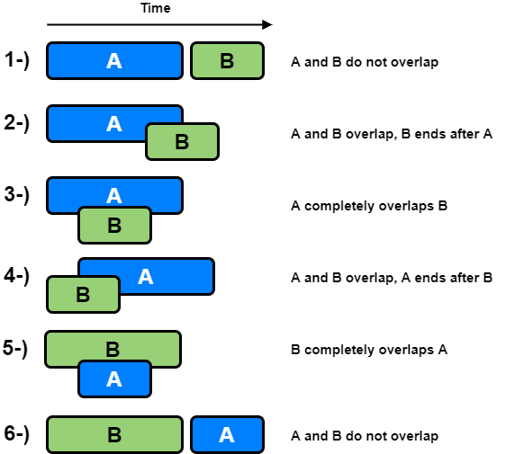

# Leetcode

This folder contains leetcode problems organized by level, and some coding patterns

# Leetcode patterns

Vocab:

- slice/subarray/substring: dãy con, mảng con, string con: là một phần của dãy chứa các phần tử LIÊN TIẾP ( **contiguous section of an array or string**)
- subsequence: 1 tập hợp 1 vài phần tử của mảng/string KHÔNG cần liên tiếp nhau, chỉ cần đúng thứ tự (portion of an array/string that keeps the same order but **doesn't need to be contiguous**)
  - Ex: subsequences of `[1, 2, 3, 4]` include: `[1, 3], [4], [], [2, 3]`, but not `[3, 2], [5], [4, 1]`.
- subset: tập hợp 1 vài phần tử của mảng/string KHÔNG cần liên tiếp nhau, KHÔNG cần đúng thứ tự
  - Ex: given `[1, 2, 3, 4]`, all of these are subsets: `[3, 2], [4, 1, 2], [1]`. Note: subsets that contain the same elements are considered the same, so `[1, 2, 4]` is the same subset as `[4, 1, 2]`.

## 1. Cheatsheets

https://leetcode.com/explore/interview/card/cheatsheets/720/resources/4725/

General DS/A flowchart: here's a flowchart that can help you figure out which data structure or algorithm should be used. Note that this flowchart is very **general** as it would be impossible to cover every single scenario


## 2. Two pointers

https://leetcode.com/explore/interview/card/leetcodes-interview-crash-course-data-structures-and-algorithms/703/arraystrings/4501/

DS involved: Array, String

Idea cho 1 mảng/string: sử dụng 2 pointer i,j chạy từ 2 phía của mảng arr[] và duyệt. Sau mỗi bước duyệt có thể sẽ tăng i hoặc giảm j hoặc cả 2, tới khi i == j thì stop

```
function fn(arr):
    left = 0
    right = arr.length - 1

    while left < right:
        Do some logic here depending on the problem
        Do some more logic here to decide on one of the following:
            1. left++
            2. right--
            3. Both left++ and right--
```

Idea cho 2 mảng: sử dụng 2 pointer i,j chạy từ 2 đầu của 2 mảng arr1[] và arr2[] và duyệt. Sau mỗi bước sẽ tăng i hoặc tăng j, tới khi 1 trong 2 mảng duyệt xong thì **vẫn phải duyệt nốt mảng còn lại**

```
function fn(arr1, arr2):
    i = j = 0
    while i < arr1.length AND j < arr2.length:
        Do some logic here depending on the problem
        Do some more logic here to decide on one of the following:
            1. i++
            2. j++
            3. Both i++ and j++

    // Step 4: make sure both iterables are exhausted
    while i < arr1.length:
        Do some logic here depending on the problem
        i++

    while j < arr2.length:
        Do some logic here depending on the problem
        j++
```

Example problems:

- [Two Sum](./easy/TwoSum_1.java)
- [Is Subsequence](./easy/IsSubsequence_392.java)

## 3. Sliding window

https://leetcode.com/explore/interview/card/leetcodes-interview-crash-course-data-structures-and-algorithms/703/arraystrings/4502/

DS involved: Array, String

Idea:

- A sliding window is actually implemented using two pointers
- Sử dụng 2 pointer `left`, `right` chạy từ 1 phía của mảng arr[] và duyệt. Dãy con từ `left` -> `right` chính là window
- Ta cần tìm window tối ưu nhất
- Duyệt bằng cách tăng con trỏ `right` để **tăng** kích thước window mà vẫn thoả mãn điều kiện của bài toán (constraint)
- Tới khi **constraint bị phá vỡ**, **giảm** kích thước window = cách tăng con trỏ `left` tới khi constraint is satisfied again.
- Khi cả 2 con trỏ đều tới cuối dãy thì stop

```
function fn(arr):
    left = 0
    for right in [0, arr.length - 1]:
        Do some logic to "add" element at arr[right] to window (ex: curr += arr[right])

        while left < right AND condition from problem not met:
            Do some logic to "remove" element at arr[left] from window (ex: curr -= arr[left])
            left++

        Do some logic to update the answer
        (sau khi thoái khỏi vòng while, lúc này điều kiện bài toán lại được thoả mãn, ta cần update answer)
```

Nhận xét:

- Nếu như Two Pointers sử dụng 2 con trỏ chạy từ 2 phía của 1 mảng, thì Sliding window lại sử dụng 2 con trỏ chạy từ 1 phía của mảng
- Ta cần dùng 2 vòng for/while lồng nhau, tuy vậy độ phức tạp vẫn là O(2n) = O(n)
  - 1 vòng for để tăng kích thước window (right++)
  - 1 vòng while để giảm kích thước window (left++)
- Giống với kỹ thuật [Caterpillar method](https://app.codility.com/programmers/lessons/15-caterpillar_method/) bên Codility

Example 1: cho dãy `nums` và số `k`, tìm độ dài của slice lớn nhất của `nums` có tổng ko vượt quá k. Ex: `nums = [3, 1, 2, 7, 4, 2, 1, 1, 5]` và `k = 8` => ans = 4 (là length của slice [4, 2, 1, 1])

```java
public int findLength(int[] nums, int k) {
    int left = 0;
    int currSum = 0;
    int ans = 0;

    for (int right = 0; right < nums.length; right++) {
        currSum += nums[right];
        while (currSum > k) {
            currSum -= nums[left]; // "remove" element at arr[left] from window
            left++;
        }

        // update the answer when condition is satisfied again
        ans = Math.max(ans, right - left + 1);
    }

    return ans;
}
```

Example 2: Cho 1 binary string chỉ gồm 2 ký tự '0' và '1'. Một hành động **flipping** là việc biến 1 ký tự '0' thành '1'. Tìm độ dài của substring lớn nhất mà chỉ chứa ký tự '1' sau khi thực thi TỐI ĐA 1 lần flipping. Ex: s = "1101100111" => ans = 5 (flipping tại index 2)

Nhận xét: bài toán có thể phát biểu lại thành: tìm độ dài của substring lớn nhất mà chỉ chứa TỐI ĐA 1 ký tự '0'

```java
public int findLength(String s) {
    int left = 0;
    int curr = 0;
    int ans = 0;

    for (int right = 0; right < s.length(); right++) {
        if (s.charAt(right) == '0') {
            curr++;
        }

        while (curr > 1) {
            if (s.charAt(left) == '0') {
                curr--;
            }

            left++;
        }

        ans = Math.max(ans, right - left + 1);
    }

    return ans;
}
```

Fixed window size: window sẽ ko thay đổi size trong quá trình duyệt, case này thì dễ hơn.

```
// first approach
function fn(arr, k):
    curr = some data type to track the window

    // build the first window
    for i in [0, k - 1]:
        Do something with curr or other variables to build first window

    ans = answer variable, might be equal to curr here depending on the problem
    for i in [k, arr.length - 1]:
        Add arr[i] to window
        Remove arr[i - k] from window
        Update ans

    return ans

// second approach
function fn(arr, k):
    curr = some data type to track the window
    ans = answer variable
    for i in range(len(arr)):
        if i >= k:
            Update ans
            Remove arr[i - k] from window
        Add arr[i] to window

    Update ans
    return ans // Alternatively, you could do something like return max(ans, curr) if the problem is asking for a maximum value and curr is tracking that.
```

## 4. More common patterns

https://leetcode.com/explore/interview/card/leetcodes-interview-crash-course-data-structures-and-algorithms/703/arraystrings/4504/

- O(n) string building: nên dùng StringBuilder để concatenate chuỗi, test performance tại dây: https://github.com/anhtuta/spring/blob/master/Demo/src/main/java/hello/StringBuilderDemo.java
- Subarrays/substrings, subsequences, and subsets
  - Subarrays/substrings: có thể dùng các pattern **sliding window**, **prefix sum**
  - Subsequences:
    - KHÔNG thể dùng được các pattern **sliding window**, **prefix sum**
    - Nếu như bài toán KHÔNG quan tâm đến order của các phần tử bên trong subsequence (chẳng hạn tính tổng của subsequence), thì có thể sort input và làm như subsets bên dưới
  - Subsets:
    - Do ko quan tâm đến order nên có thể **sort** input
    - Sau khi sort có thể dùng các pattern: two pointers, sliding window, greedy, backtracking...

## 5. Fast and slow pointers

Do pattern này ở leetcode yêu cầu account premium, nên từ nay về sau, pattern nào trên đó premium thì sẽ dùng link khác để tham khảo

https://emre.me/coding-patterns/fast-slow-pointers/

DS involved: LinkedList, Array, String

AKA: Floyd's Tortoise and Hare Algorithm

Idea:

- Dùng 2 con trỏ fast, slow cùng chạy từ đầu list.
- Con trỏ fast sẽ chạy nhanh hơn slow. Tới khi 2 con trỏ gặp nhau thì chứng tỏ list này là DSLK vòng (cyclic linked list), tức là sẽ detect được **cyclic loop**

Example problems:

- [LinkedListCycle_141](./easy/LinkedListCycle_141.java)
- [LinkedListCycleII_142](./medium/LinkedListCycleII_142.java)

## 6. Merge intervals

https://emre.me/coding-patterns/merge-intervals/

Các interval ở đây có 2 thuộc tính là start và end. Có thể dùng mảng 2 chiều để lưu chúng, chẳng hạn:

```java
int[][] intervals = {{2, 6}, {15, 18}, {1, 3}, {8, 10}};
```

Đề bài sẽ yêu cầu merge các interval bị overlap nhau (ex: [2, 6] + [1, 3] -> [1, 6])

DS involved: Array, Heap



Idea:

- Đầu tiên **sort** các interval đó theo thứ tự tăng dần của `interval.start`
- Sau khi sort xong, chỉ cần set các case 1,2,3 ở hình trên
- Init interval A là phần tử đầu tiên của dãy, index 0
- Duyệt B từ index 1
  - B overlap với A khi: `B.start <= A.end`
  - Nếu B overlap với A: merge B với A bằng cách: `A.end = max(A.end, B.end)`, sau đó tiếp tục duyệt B ở vòng for tiếp theo
  - Nếu B ko overlap với A:
    - Interval A lúc này đã merge xong, add A hiện tại vào ans (kết quả của bài toán)
    - Gán cho A là interval hiện tại và duyệt tới hết dãy
  - Sau khi duyệt tới hết dãy, nhớ add nốt A vào ans

Example problems:

- [MergeIntervals_56](./medium/MergeIntervals_56.java)

## 7. Cyclic sort

https://emre.me/coding-patterns/cyclic-sort/

DS involved: Array

Idea:

- Chỉ dùng cho mảng a[] gồm các phần tử range từ 0 -> n (n = a.length), và chúng phải khác nhau
- Bởi vì các phần tử là unique, ta có thể exchange vị trí của chúng để chúng ở đúng vị trí
- Ex: [8, 6, 4, 2, 3, 5, 7, 0, 1] -> [0 1 2 3 4 5 6 7 8]
- Dùng với các bài toán: find missing number, duplicate numbers

Example problems:

- [MissingNumber_268](./easy/MissingNumber_268.java)
