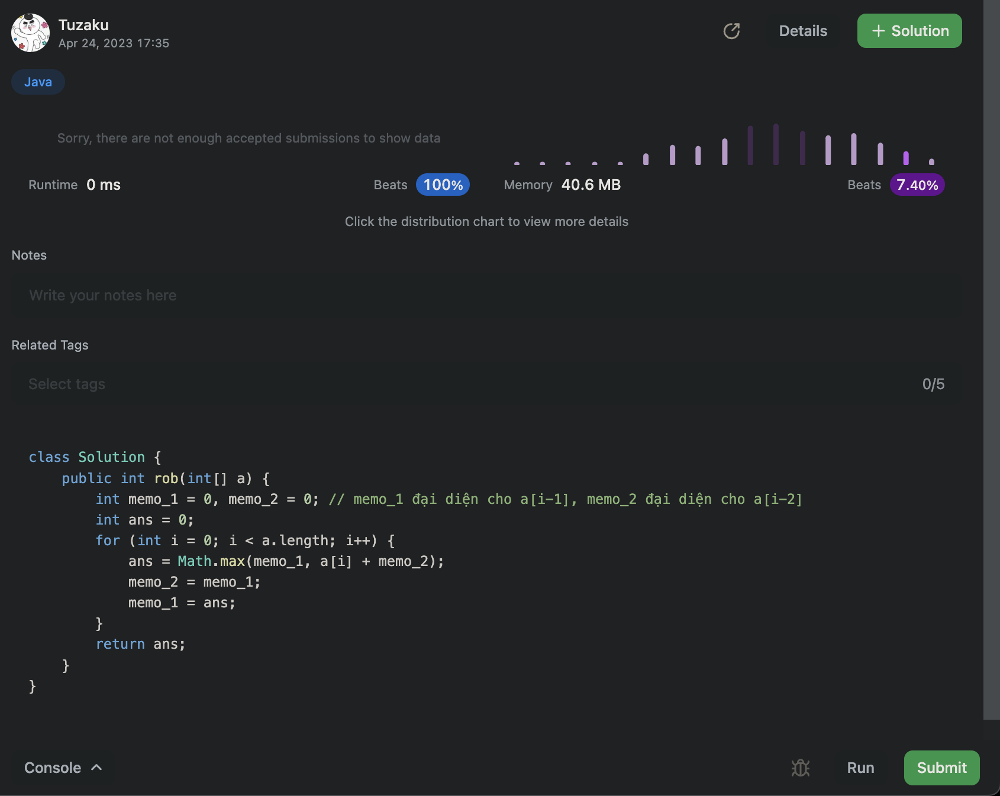
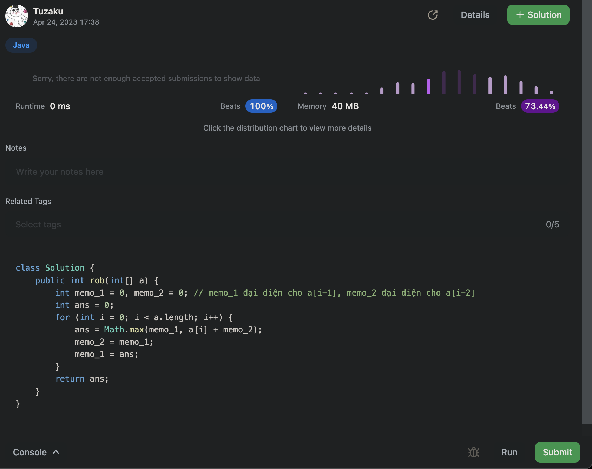
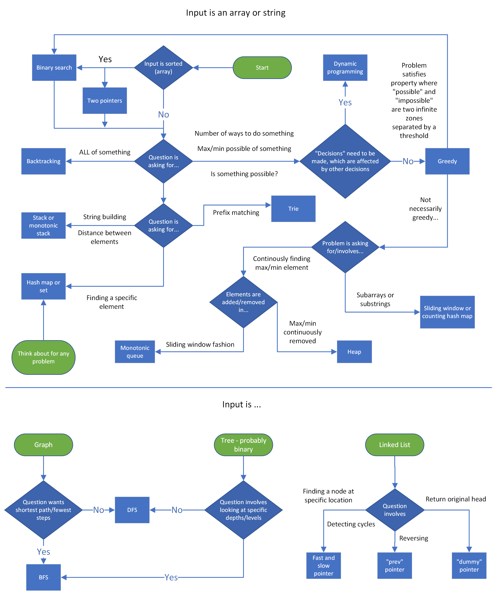

# Leetcode

This folder contains leetcode problems organized by level, and some coding patterns

Start studying at **31/3/2023** (includes both codility and leetcode), my leetcode rank at the beginning: >= `3,000,000`

- Rank after 1 month: >= `1,500,000`

Note: memory complexity ở leetcode nhiều khi ko đúng lắm (time complexity cũng tương tự, nhưng chênh lệch nhau ít hơn), bằng chứng là 1 solution submit 2 lần nhưng có 2 kq khác nhau:





Với mỗi bài leetcode, nên vào tab Solutions, dù lời giải đã được accepted. Tại sao? Vì đôi khi sẽ thấy 1 comment rất tâm huyết như này, hướng dẫn cách tiếp cận chi tiết từ naive tới pro:

https://leetcode.com/problems/house-robber/solutions/156523/from-good-to-great-how-to-approach-most-of-dp-problems/

Một số bài input range quá lớn, chẳng hạn trong khoảng [-10^9, 10^9], nếu input đó kiểu `int`, thì các phép toán cộng trừ dễ bị tràn bộ nhớ, cần xét test case mà input = 10^9 xem có sao ko, như bài [FourSum_18](./medium/FourSum_18.java). Cách khắc phục:

- Ép sang kiểu long xong rồi cộng trừ tiếp
- Không cộng 2 số nữa mà hãy trừ, ex:
  - `int sum = a[left] + a[right]; if (sum == target) {}` viết lại thành: `if (target - a[left] == a[right])`
  - Trong binary search: `int mid = (left + right)/2` viết lại thành: `int mid = left + (right - left) / 2`

# Leetcode patterns

Vocab:

- slice/subarray/substring: dãy con, mảng con, string con: là một phần của dãy chứa các phần tử LIÊN TIẾP ( **contiguous section of an array or string**)
- subsequence: 1 tập hợp 1 vài phần tử của mảng/string KHÔNG cần liên tiếp nhau, chỉ cần đúng thứ tự (portion of an array/string that keeps the same order but **doesn't need to be contiguous**)
  - Ex: subsequences of `[1, 2, 3, 4]` include: `[1, 3], [4], [], [2, 3]`, but not `[3, 2], [5], [4, 1]`.
- subset: tập hợp 1 vài phần tử của mảng/string KHÔNG cần liên tiếp nhau, KHÔNG cần đúng thứ tự
  - Ex: given `[1, 2, 3, 4]`, all of these are subsets: `[3, 2], [4, 1, 2], [1]`. Note: subsets that contain the same elements are considered the same, so `[1, 2, 4]` is the same subset as `[4, 1, 2]`.

## 1. Cheatsheets

https://leetcode.com/explore/interview/card/cheatsheets/720/resources/4725/

### Input sizes vs time complexity

- n <= 10: `O(n^2 * n!)` or `O(4^n)`: You should think about backtracking or any brute-force recursive algorithm
- 10 < n <= 20: `O(2^n)`: Consider brute-force, backtracking and recursion
- 20 < n <= 100: `O(n^3)`: Consider brute force solutions, and try to improve on "slow" steps using tools like hash maps or heaps.
- 100 < n <= 1,000: `O(n^2)`: Consider nested loops
- 1,000 < n < 100,000 = 10^5: `O(n⋅logn)`:
  - Ask yourself if sorting the input or using a heap can be helpful
  - Nested loops that run in `O(n^2)` are unacceptable
  - Consider make use of the following techniques: hash map, two pointer, sliding window, binary search, heap
- 100,000 < n < 1,000,000 = 10^6: `O(n)`, but sometimes `O(n⋅logn)` is safe: Consider using above techniques with a hash map
- n > 1,000,000 = 10^6: `O(logn)` or `O(1)`: Consider use binary search, hash map

### General DS/A flowchart

Here's a flowchart that can help you figure out which data structure or algorithm should be used. Note that this flowchart is very **general** as it would be impossible to cover every single scenario



## 2. Two pointers

https://leetcode.com/explore/interview/card/leetcodes-interview-crash-course-data-structures-and-algorithms/703/arraystrings/4501/

DS involved: Array, String

Idea cho 1 mảng/string: sử dụng 2 pointer i,j chạy từ 2 phía của mảng arr[] và duyệt. Sau mỗi bước duyệt có thể sẽ tăng i hoặc giảm j hoặc cả 2, tới khi i == j thì stop

```
function fn(arr):
    left = 0
    right = arr.length - 1

    while left < right:
        Do some logic here depending on the problem
        Do some more logic here to decide on one of the following:
            1. left++
            2. right--
            3. Both left++ and right--
```

Idea cho 2 mảng: sử dụng 2 pointer i,j chạy từ 2 đầu của 2 mảng arr1[] và arr2[] và duyệt. Sau mỗi bước sẽ tăng i hoặc tăng j, tới khi 1 trong 2 mảng duyệt xong thì **vẫn phải duyệt nốt mảng còn lại**

```
function fn(arr1, arr2):
    i = j = 0
    while i < arr1.length AND j < arr2.length:
        Do some logic here depending on the problem
        Do some more logic here to decide on one of the following:
            1. i++
            2. j++
            3. Both i++ and j++

    // Step 4: make sure both iterables are exhausted
    while i < arr1.length:
        Do some logic here depending on the problem
        i++

    while j < arr2.length:
        Do some logic here depending on the problem
        j++
```

Example problems:

- [Two Sum](./easy/TwoSum_1.java)
- [Is Subsequence](./easy/IsSubsequence_392.java)
- [ThreeSum_15](./medium/ThreeSum_15.java)
- [ThreeSumClosest_16](./medium/ThreeSumClosest_16.java)

## 3. Sliding window

https://leetcode.com/explore/interview/card/leetcodes-interview-crash-course-data-structures-and-algorithms/703/arraystrings/4502/

DS involved: Array, String

Idea:

- A sliding window is actually implemented using two pointers
- Sử dụng 2 pointer `left`, `right` chạy từ 1 phía của mảng arr[] và duyệt. Dãy con từ `left` -> `right` chính là window
- Ta cần tìm window tối ưu nhất
- Duyệt bằng cách tăng con trỏ `right` để **tăng** kích thước window mà vẫn thoả mãn điều kiện của bài toán (constraint)
- Tới khi **constraint bị phá vỡ**, **giảm** kích thước window = cách tăng con trỏ `left` tới khi constraint is satisfied again.
- Khi cả 2 con trỏ đều tới cuối dãy thì stop

```
function fn(arr):
    left = 0
    for right in [0, arr.length - 1]:
        Do some logic to "add" element at arr[right] to window (ex: curr += arr[right])

        while left < right AND condition from problem not met:
            Do some logic to "remove" element at arr[left] from window (ex: curr -= arr[left])
            left++

        Do some logic to update the answer
        (sau khi thoái khỏi vòng while, lúc này điều kiện bài toán lại được thoả mãn, ta cần update answer)
```

Alternative implementation (my opinion): có thể dùng vòng while thay cho for (Xem ví dụ bài LongestSubstringWithoutRepeatingCharacters_3):

```java
void solution(int[] arr) {
    int left = 0, right = 0;
    while (right < arr.length) { // đôi khi cần thêm điều kiện left <= right)
        if condition from problem is met:
            "add" element at arr[right] to window (ex: curr += arr[right])
            Increase window size: right++
            Update the answer
        else (condition from problem is NOT met):
            "remove" element at arr[left] from window (ex: curr -= arr[left])
            Decrease window size: left++
    }
    Update the answer if needed
}
```

Nhận xét:

- Nếu như Two Pointers sử dụng 2 con trỏ chạy từ 2 phía của 1 mảng, thì Sliding window lại sử dụng 2 con trỏ chạy từ 1 phía của mảng
- Ta cần dùng 2 vòng for/while lồng nhau, tuy vậy độ phức tạp vẫn là O(2n) = O(n)
  - 1 vòng for để tăng kích thước window (right++)
  - 1 vòng while để giảm kích thước window (left++)
- Giống với kỹ thuật [Caterpillar method](https://app.codility.com/programmers/lessons/15-caterpillar_method/) bên Codility

Example 1: cho dãy `nums` và số `k`, tìm độ dài của slice lớn nhất của `nums` có tổng ko vượt quá k. Ex: `nums = [3, 1, 2, 7, 4, 2, 1, 1, 5]` và `k = 8` => ans = 4 (là length của slice [4, 2, 1, 1])

```java
public int findLength(int[] nums, int k) {
    int left = 0;
    int currSum = 0;
    int ans = 0;

    for (int right = 0; right < nums.length; right++) {
        currSum += nums[right];
        while (currSum > k) {
            currSum -= nums[left]; // "remove" element at arr[left] from window
            left++;
        }

        // update the answer when condition is satisfied again
        ans = Math.max(ans, right - left + 1);
    }

    return ans;
}
```

Example 2: Cho 1 binary string chỉ gồm 2 ký tự '0' và '1'. Một hành động **flipping** là việc biến 1 ký tự '0' thành '1'. Tìm độ dài của substring lớn nhất mà chỉ chứa ký tự '1' sau khi thực thi TỐI ĐA 1 lần flipping. Ex: s = "1101100111" => ans = 5 (flipping tại index 2)

Nhận xét: bài toán có thể phát biểu lại thành: tìm độ dài của substring lớn nhất mà chỉ chứa TỐI ĐA 1 ký tự '0'

```java
public int findLength(String s) {
    int left = 0;
    int curr = 0;
    int ans = 0;

    for (int right = 0; right < s.length(); right++) {
        if (s.charAt(right) == '0') {
            curr++;
        }

        while (curr > 1) {
            if (s.charAt(left) == '0') {
                curr--;
            }

            left++;
        }

        ans = Math.max(ans, right - left + 1);
    }

    return ans;
}
```

Fixed window size: window sẽ ko thay đổi size trong quá trình duyệt, case này thì dễ hơn.

```
// first approach
function fn(arr, k):
    curr = some data type to track the window

    // build the first window
    for i in [0, k - 1]:
        Do something with curr or other variables to build first window

    ans = answer variable, might be equal to curr here depending on the problem
    for i in [k, arr.length - 1]:
        Add arr[i] to window
        Remove arr[i - k] from window
        Update ans

    return ans

// second approach
function fn(arr, k):
    curr = some data type to track the window
    ans = answer variable
    for i in range(len(arr)):
        if i >= k:
            Update ans
            Remove arr[i - k] from window
        Add arr[i] to window

    Update ans
    return ans // Alternatively, you could do something like return max(ans, curr) if the problem is asking for a maximum value and curr is tracking that.
```

Kết hợp sliding window với hashmap (hoặc counting array) cho các bài toán với String (my personal template):

```java
public int solution(String s) {
    int[] cntArr = new int[128]; // Bảng ASCII tối đa 127 ký tự
    int left = 0;
    int right = 0;

    while (right < s.length()) {
        if condition from problem is met:
            "add" element at arr[right] to window (ex: curr += arr[right])
            Increase window size:
                cntArr[s.charAt(right)]++ // có thêm đoạn này là khác với các dạng trước đó
                right++
            Update the answer
        else:
            "remove" element at arr[left] from window (ex: curr -= arr[left])
            Decrease window size:
                cntArr[s.charAt(left)]-- // có thêm đoạn này là khác với các dạng trước đó
                left++
    }
    return answer;
}
```

Example problems:

- [3. Longest Substring Without Repeating Characters](./medium/LongestSubstringWithoutRepeatingCharacters_3.java)
- [76. Minimum Window Substring](./hard/MinimumWindowSubstring_76.java)

## 4. More common patterns

https://leetcode.com/explore/interview/card/leetcodes-interview-crash-course-data-structures-and-algorithms/703/arraystrings/4504/

- O(n) string building: nên dùng StringBuilder để concatenate chuỗi, test performance tại dây: https://github.com/anhtuta/spring/blob/master/Demo/src/main/java/hello/StringBuilderDemo.java
- Subarrays/substrings, subsequences, and subsets
  - Subarrays/substrings: có thể dùng các pattern **sliding window**, **prefix sum**
  - Subsequences:
    - KHÔNG thể dùng được các pattern **sliding window**, **prefix sum**
    - Nếu như bài toán KHÔNG quan tâm đến order của các phần tử bên trong subsequence (chẳng hạn tính tổng của subsequence), thì có thể sort input và làm như subsets bên dưới
  - Subsets:
    - Do ko quan tâm đến order nên có thể **sort** input
    - Sau khi sort có thể dùng các pattern: two pointers, sliding window, greedy, backtracking...

## 5. Fast and slow pointers

Do pattern này ở leetcode yêu cầu account premium, nên từ nay về sau, pattern nào trên đó premium thì sẽ dùng link khác để tham khảo

https://emre.me/coding-patterns/fast-slow-pointers/

DS involved: LinkedList, Array, String

AKA: Floyd's Tortoise and Hare Algorithm

Idea:

- Dùng 2 con trỏ fast, slow cùng chạy từ đầu list.
- Con trỏ fast sẽ chạy nhanh hơn slow. Tới khi 2 con trỏ gặp nhau thì chứng tỏ list này là DSLK vòng (cyclic linked list), tức là sẽ detect được **cyclic loop**

Example problems:

- [LinkedListCycle_141](./easy/LinkedListCycle_141.java)
- [LinkedListCycleII_142](./medium/LinkedListCycleII_142.java)

## 6. Merge intervals

https://emre.me/coding-patterns/merge-intervals/

Các interval ở đây có 2 thuộc tính là start và end. Có thể dùng mảng 2 chiều để lưu chúng, chẳng hạn:

```java
int[][] intervals = {{2, 6}, {15, 18}, {1, 3}, {8, 10}};
```

Đề bài sẽ yêu cầu merge các interval bị overlap nhau (ex: [2, 6] + [1, 3] -> [1, 6])

DS involved: Array, Heap


Idea:

- Đầu tiên **sort** các interval đó theo thứ tự tăng dần của `interval.start`
- Sau khi sort xong, chỉ cần set các case 1,2,3 ở hình trên
- Init interval A là phần tử đầu tiên của dãy, index 0
- Duyệt B từ index 1
  - B overlap với A khi: `B.start <= A.end`
  - Nếu B overlap với A: merge B với A bằng cách: `A.end = max(A.end, B.end)`, sau đó tiếp tục duyệt B ở vòng for tiếp theo
  - Nếu B ko overlap với A:
    - Interval A lúc này đã merge xong, add A hiện tại vào ans (kết quả của bài toán)
    - Gán cho A là interval hiện tại và duyệt tới hết dãy
  - Sau khi duyệt tới hết dãy, nhớ add nốt A vào ans

Example problems:

- [MergeIntervals_56](./medium/MergeIntervals_56.java)

## 7. Cyclic sort

https://emre.me/coding-patterns/cyclic-sort/

DS involved: Array

Idea:

- Chỉ dùng cho mảng a[] gồm các phần tử range từ 0 -> n (n = a.length), và chúng phải khác nhau
- Bởi vì các phần tử là unique, ta có thể exchange vị trí của chúng để chúng ở đúng vị trí
- Ex: [8, 6, 4, 2, 3, 5, 7, 0, 1] -> [0 1 2 3 4 5 6 7 8]
- Dùng với các bài toán: find missing number, duplicate numbers

Example problems:

- [MissingNumber_268](./easy/MissingNumber_268.java)

## 8. In-place Reversal of a Linked List

https://emre.me/coding-patterns/in-place-reversal-of-a-linked-list/

DS involved: LinkedList

Idea: dùng 3 con trỏ curr, prev, next để thực hiện việc reverse 1 LinkedList mà ko cần thêm bộ nhớ ngoài

Example problem:

- [ReverseLinkedList_206 and ReverseLinkedListII_92](./medium/ReverseLinkedList_206_92.java)

## 9. Binary search

https://leetcode.com/explore/learn/card/binary-search/125/template-i/938/

Node: nên dùng `int mid = left + (right - left) / 2;` thay vì `int mid = (left + right) / 2`, để tránh bị overflow

Template I

```java
int binarySearch(int[] nums, int target){
  if(nums == null || nums.length == 0)
    return -1;

  int left = 0, right = nums.length - 1;
  while(left <= right){
    // Prevent (left + right) overflow
    int mid = left + (right - left) / 2;
    if(nums[mid] == target){ return mid; }
    else if(nums[mid] < target) { left = mid + 1; }
    else { right = mid - 1; }
  }

  // End Condition: left > right
  return -1;
}
```

Template II

```java
int binarySearch(int[] nums, int target){
  if(nums == null || nums.length == 0)
    return -1;

  int left = 0, right = nums.length - 1;
  while(left < right){
    // Prevent (left + right) overflow
    int mid = left + (right - left) / 2;
    if(nums[mid] == target){ return mid; }
    else if(nums[mid] < target) { left = mid + 1; }
    else { right = mid; }
  }

  // Post-processing:
  // End Condition: left == right
  if(nums[left] == target) return left;
  return -1;
}
```

Template III

```java
int binarySearch(int[] nums, int target) {
    if (nums == null || nums.length == 0)
        return -1;

    int left = 0, right = nums.length - 1;
    while (left + 1 < right){
        // Prevent (left + right) overflow
        int mid = left + (right - left) / 2;
        if (nums[mid] == target) {
            return mid;
        } else if (nums[mid] < target) {
            left = mid;
        } else {
            right = mid;
        }
    }

    // Post-processing:
    // End Condition: left + 1 == right
    if(nums[left] == target) return left;
    if(nums[right] == target) return right;
    return -1;
}
```

Thực sự chưa từng dùng template II và III, bao giờ dùng sẽ update thêm

## 10. Dynamic Programming

https://leetcode.com/explore/featured/card/dynamic-programming/630/an-introduction-to-dynamic-programming/4035/

Đã từng viết 1 ghi chú về algorithm này rồi, xem thêm [tại đây](../../algorithm/dynamicprogramming/README.md)

### Top-down vs Bottom-up

Top-down (Memoization)

- Sử dụng recursion
- Sử dụng thêm biến để memoization (ghi nhớ), thường dùng array hoặc hashmap
- Memoizing a result means to **store the result of a function call**, usually in a hashmap or an array, so that **when the same function call is made again, we can simply return the memoized result** instead of recalculating the result
- Thường dễ viết hơn Bottom-up, bởi vì with recursion, the **ordering** of subproblems does not matter, whereas with tabulation, we need to go through a logical ordering of solving subproblems.

Bottom-up (Tabulation)

- Sử dụng iteration
- Bắt đầu từ base case F(0), sau đó tính toán các case sau dựa theo case trước: F(0) -> F(1) -> F(2)
- Thường nhanh hơn Top-down bởi vì ko bị overhead giống như đệ quy

Chốt lại: **top-down uses recursion, and bottom-up uses iteration**

### When to Use DP

Here are some common characteristics of DP problems that are easy to identify:

- The problem will ask for the optimum value (maximum or minimum) of something, or the number of ways there are to do something (but only this characteristic is NOT sufficient!):
  - What is the minimum cost of doing...
  - What is the maximum profit from...
  - How many ways are there to do...
  - What is the longest possible...
  - Is it possible to reach a certain point...
- Future "decisions" depend on earlier decisions: deciding to do something at one step may affect the ability to do something in a later step

VD1: bài toán [House robber](https://leetcode.com/problems/house-robber/): cho mảng arr đại diện cho số tiền của các ngôi nhà trên 1 con phố, nhiệm vụ của bạn là cướp nhiều tiền nhất có thể, nhưng ko được cướp 2 nhà liên tiếp. Chẳng hạn, với arr = [2,7,9,3,1], bạn sẽ cướp nhà có số tiền = 2,9,1. Tổng số tiền tối đa có thể cướp được = 2+9+1 = 13

Nếu duyệt từ đầu, ta có thể xem xét có nên cướp nhà đầu tiên hoặc nhà thứ hai (2 và 7). Nếu dùng greedy, ta sẽ chọn nhà thứ hai (7 tiền), nhưng sẽ bỏ lỡ nhà thứ 3 (có 9 tiền). Rõ ràng: việc chọn nhà đầu tiên hay thứ hai sẽ ảnh hưởng tới quyết định chọn các nhà sau đó (decision between robbing the first or second house affects which options are available for future decisions)

VD2: bài toán [Longest Increasing Subsequence](https://leetcode.com/problems/longest-increasing-subsequence/): cho mảng số nguyên arr, tìm độ dài Subsequence tăng dần lớn nhất. Chẳng hạn arr = [10,9,2,5,3,7,101,18], thì đáp án là subsequence [2,3,7,101], hoặc [2,5,7,18], có độ dài = 4. Với arr = [1, 2, 6, 3, 5], thì subsequence phải tìm là [1,2,3,5]

Nếu duyệt từ đầu, quyết định quan trọng nhất là khi duyệt đến số 6, ta sẽ lấy hay ko lấy. Nếu lấy 6 thì ko thể lấy 3,5 nữa. Rõ ràng quyết định tại số 6 sẽ ảnh hưởng tới các quyết định sau đó

> When you're solving a problem on your own and trying to decide if the second characteristic is applicable, assume it isn't, then try to think of a counterexample that proves a greedy algorithm won't work. If you can think of an example where earlier decisions affect future decisions, then DP is applicable

> Divide and conquer approaches can be parallelized while dynamic programming approaches cannot (actually DP cannot be easily parallelized)

This is because the subproblems in divide an conquer approaches are independent of one another (they do NOT overlap) while in dynamic programming, the subproblems do overlap

### From good to great. How to approach most of DP problems

Most of DP problems can be approached using the following sequence:

1. Find recursive relation
2. Recursive (top-down)
3. Recursive + memo (top-down)
4. Iterative + memo (bottom-up)
5. Iterative + N variables (bottom-up)

Hãy xem bài [HouseRobber_198](./medium/HouseRobber_198.java) để hiểu

Note: không phải bài nào cũng dùng được tới bước 5, tức là dùng bottom-up với N biến, mà chỉ tối ưu được đến step 4, dùng bottom up + mảng memo. Cụ thể là bài [UniquePaths_62](./medium/UniquePaths_62.java)

### Example problems

- [HouseRobber_198](./medium/HouseRobber_198.java)
- [UniquePaths_62](./medium/UniquePaths_62.java)
- [LongestPalindromicSubsequence_516](./medium/LongestPalindromicSubsequence_516.java)
- [LongestCommonSubsequence_1143](./medium/LongestCommonSubsequence_1143.java)

So sánh:

- `LongestPalindromicSubsequence_516`, `UniquePaths_62` và `LongestCommonSubsequence_1143` có điểm chung ở chỗ: tại mỗi vị trí i, ta chỉ có 1 case là sẽ lấy i, nên việc tính toán khá đơn giản. Trong khi đó bài `HouseRobber_198` sẽ có 2 case là có lấy i hay ko lấy i, do đó phải xét cả 2 case xong tìm max value giữa chúng

## 11. Recursion

https://leetcode.com/explore/learn/card/recursion-i/

# Ref

- https://levelup.gitconnected.com/dont-just-leetcode-follow-the-coding-patterns-instead-4beb6a197fdb
